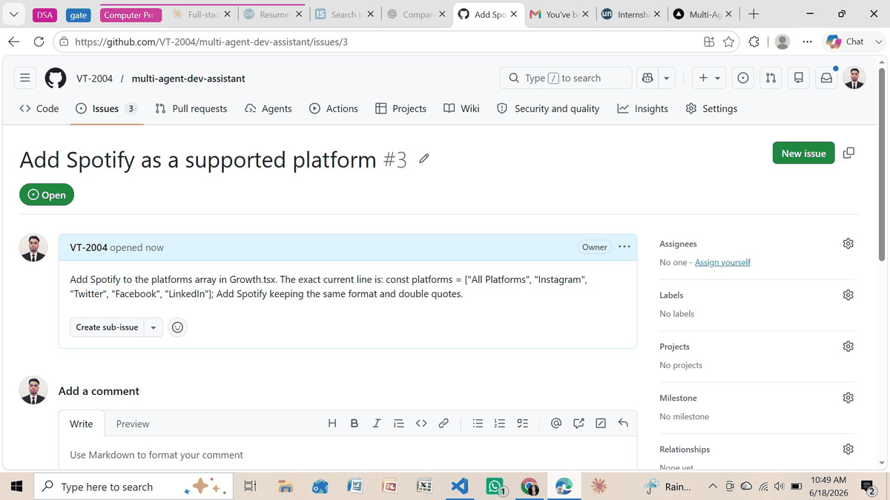
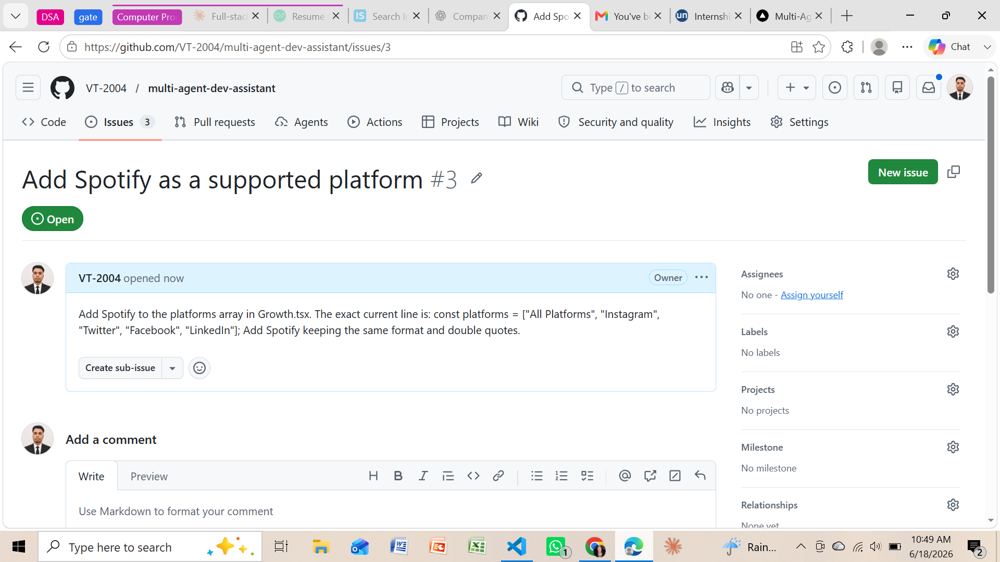
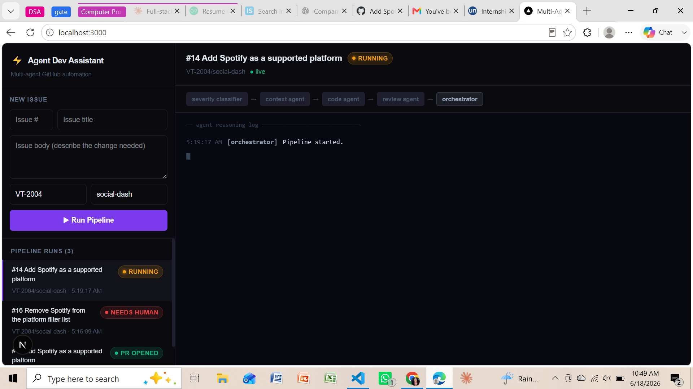
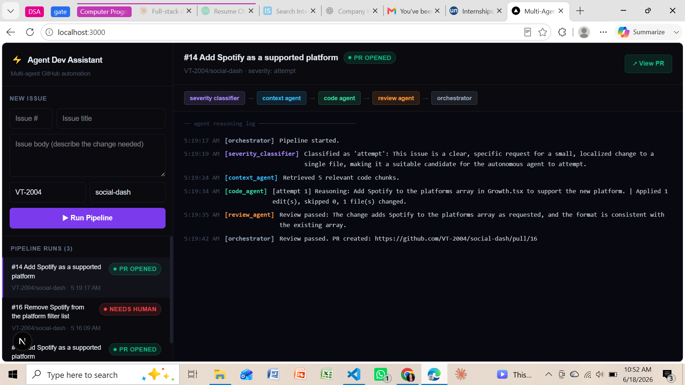
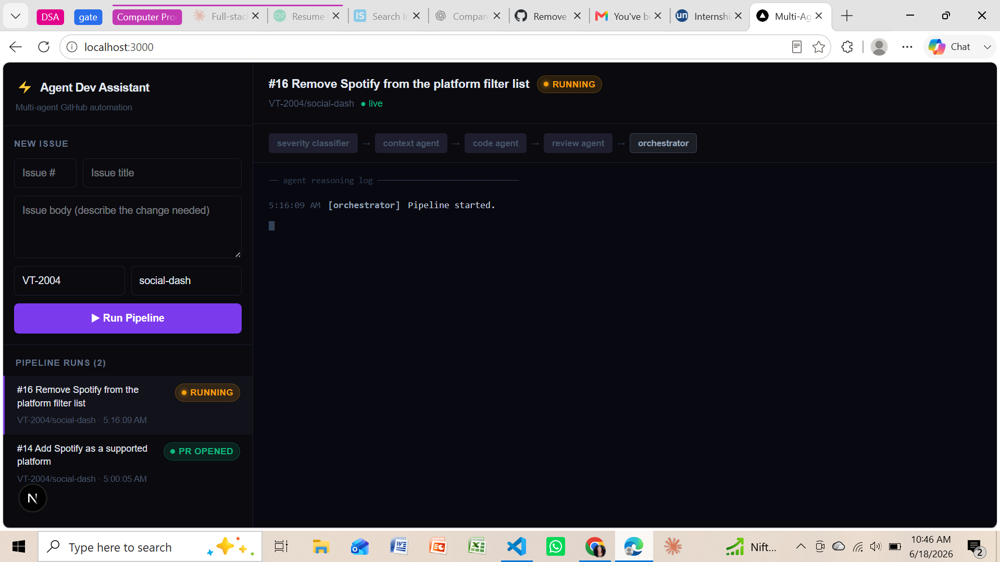
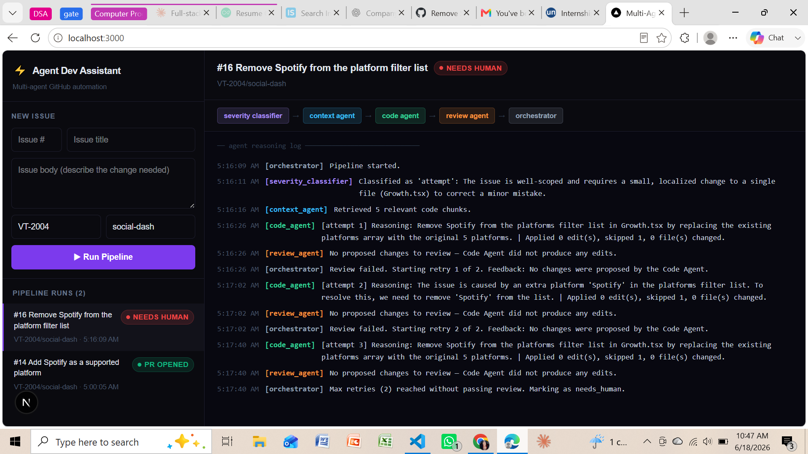

# ⚡ Multi-Agent Dev Assistant

> An autonomous AI system that reads a GitHub issue, retrieves relevant codebase context, generates a targeted code fix, reviews it, and opens a Pull Request — automatically.

Built with **LangGraph**, **LangChain**, **Groq (Llama 3.1)**, **ChromaDB**, **FastAPI**, and **Next.js**.

---

## Demo



*GitHub issue created → agents reason in real time → PR opened automatically in ~34 seconds*

---

## Live Proof

- **Tool repo:** [github.com/VT-2004/multi-agent-dev-assistant](https://github.com/VT-2004/multi-agent-dev-assistant)
- **Auto-generated PRs:** [github.com/VT-2004/social-dash/pulls](https://github.com/VT-2004/social-dash/pulls) — real PRs opened by the agent on a live repo

---

## Results

| Metric | Value |
|--------|-------|
| Autonomous resolution rate | **75%** of in-scope issues |
| Average time-to-PR | **34 seconds** |
| Out-of-scope issues correctly skipped | **2/2** in under 3 seconds |
| Crashes across 10-issue batch test | **0** |

---

## Pipeline Outcomes

The system handles two outcomes automatically:

### ✅ Success — PR Opened

**1. GitHub Issue Created**



**2. Dashboard — Agents Running Live**



**3. Output — PR Opened Automatically**



---

### 🔴 Escalation — Needs Human

When the agent cannot confidently resolve an issue after retries, it correctly escalates rather than merging bad code.

**4. Dashboard — Agents Running (complex issue)**



**5. Output — Needs Human (with full retry log)**



The full retry reasoning is visible in the log — every attempt, every failure reason, and the final escalation decision. A human can pick up exactly where the agent left off.

---

## How It Works
User opens GitHub issue

↓

GitHub webhook fires → FastAPI receives it instantly

↓

Severity Classifier → attempt or skip?

↓ (attempt)

Context Agent → RAG search over codebase (ChromaDB)

↓

Code Agent → Groq Llama 3.1 generates targeted JSON edit

↓

Review Agent → checks diff for bugs / security issues

↓ (fail → retry with feedback, max 2 retries)

↓ (pass)

GitHub PR created automatically

↓

Next.js Dashboard → live agent reasoning log via WebSocket

---

## Architecture
multi-agent-dev-assistant/

├── backend/

│   ├── app/

│   │   ├── agents/

│   │   │   ├── orchestrator.py        # LangGraph StateGraph — wires all agents

│   │   │   ├── severity_classifier.py # Groq LLM — attempt or skip?

│   │   │   ├── code_agent.py          # Groq LLM — generates JSON search/replace edits

│   │   │   ├── review_agent.py        # Groq LLM — reviews diff for bugs/security

│   │   │   └── context_agent.py       # RAG retrieval node

│   │   ├── core/

│   │   │   ├── state.py               # LangGraph AgentState TypedDict

│   │   │   ├── config.py              # .env loader

│   │   │   ├── job_store.py           # In-memory job tracking

│   │   │   └── pipeline_runner.py     # Async background task runner

│   │   ├── rag/

│   │   │   ├── ingest.py              # Clone target repo via GitPython

│   │   │   ├── chunker.py             # Language-aware code chunking

│   │   │   ├── vectorstore.py         # ChromaDB + sentence-transformers embeddings

│   │   │   └── retriever.py           # Cosine similarity retrieval

│   │   ├── github_integration/

│   │   │   ├── client.py              # PyGithub wrapper

│   │   │   ├── pr_manager.py          # Branch + commit + PR creation

│   │   │   └── webhook.py             # GitHub webhook signature verification

│   │   ├── websocket/

│   │   │   └── manager.py             # WebSocket connection manager

│   │   ├── api/

│   │   │   └── routes.py              # FastAPI routes + webhook endpoint

│   │   └── main.py                    # FastAPI app entry point

│   ├── data/

│   │   ├── chroma_db/                 # Vector store (gitignored)

│   │   └── repos/                     # Cloned target repos (gitignored)

│   ├── requirements.txt

│   └── .env.example

├── frontend/

│   ├── app/

│   │   ├── page.tsx                   # Dashboard UI

│   │   ├── layout.tsx

│   │   └── globals.css

│   ├── lib/

│   │   └── api.ts                     # API client + WebSocket

│   └── package.json

├── docs/

│   └── images/                        # Screenshots and demo GIF

├── docker-compose.yml

└── README.md

---

## Tech Stack

| Layer | Technology |
|-------|-----------|
| Agent orchestration | LangGraph — StateGraph with conditional edges + retry loops |
| LLM | Groq — Llama 3.1 8B Instant (128K context, free tier) |
| RAG / Vector store | ChromaDB + sentence-transformers (all-MiniLM-L6-v2) |
| Code chunking | LangChain RecursiveCharacterTextSplitter (language-aware) |
| Backend | FastAPI + async background tasks + WebSockets |
| GitHub integration | PyGithub (branch, commit, PR) + webhook verification |
| Frontend | Next.js 15 + TypeScript + Tailwind CSS |
| Tunneling (dev) | Cloudflare Tunnel (exposes local server for webhook) |

---

## Quick Start

### Prerequisites
- Python 3.11+
- Node.js 18+
- Groq API key — free at [console.groq.com](https://console.groq.com)
- GitHub Personal Access Token — Settings → Developer settings → Tokens → `repo` scope

### 1. Clone the repo

```bash
git clone https://github.com/VT-2004/multi-agent-dev-assistant.git
cd multi-agent-dev-assistant
```

### 2. Backend setup

```bash
cd backend
python -m venv venv

# Windows
.\venv\Scripts\Activate.ps1

# Mac/Linux
source venv/bin/activate

pip install -r requirements.txt
cp .env.example .env
# Fill in GROQ_API_KEY and GITHUB_TOKEN in .env
```

### 3. Index your target repo

```bash
python -m app.rag.ingest https://github.com/<owner>/<repo>.git <repo-name>
python -m app.rag.vectorstore ./data/repos/<repo-name> <repo-name>
```

### 4. Start the backend

```bash
uvicorn app.main:app --reload --port 8000
```

### 5. Frontend setup

```bash
cd ../frontend
npm install
npm run dev
```

### 6. Open the dashboard

Visit `http://localhost:3000` — fill in the trigger form or set up the webhook for automatic triggering.

---

## Webhook Setup (Automatic Triggering)

To trigger pipelines automatically when GitHub issues are created:

1. Expose your local server with Cloudflare Tunnel:
```bash
./cloudflared.exe tunnel --url http://localhost:8000
```

2. Go to `https://github.com/<owner>/<repo>/settings/hooks`
3. Add webhook:
   - **Payload URL:** `https://your-tunnel-url.trycloudflare.com/api/webhook/github`
   - **Content type:** `application/json`
   - **Events:** Issues only

Now any new issue on the repo triggers the pipeline automatically — no manual input needed.

---

## Docker (Self-Hosted)

```bash
cp backend/.env.example backend/.env
# Fill in your keys in backend/.env
docker-compose up --build
```

- Backend: `http://localhost:8000`
- Frontend: `http://localhost:3000`

---

## Environment Variables

| Variable | Description |
|----------|-------------|
| `GROQ_API_KEY` | Groq API key for Llama 3.1 |
| `GITHUB_TOKEN` | GitHub PAT with `repo` scope |
| `GITHUB_WEBHOOK_SECRET` | Secret for webhook signature verification (optional) |
| `TARGET_REPO_OWNER` | Default repo owner |
| `TARGET_REPO_NAME` | Default repo name |
| `CHROMA_DB_PATH` | Path for ChromaDB persistence (default: `./data/chroma_db`) |
| `REPO_CLONE_PATH` | Path for cloned repos (default: `./data/repos`) |

---

## Extending to Other Repos

Index any GitHub repo in two commands:

```bash
python -m app.rag.ingest https://github.com/<owner>/<repo>.git <repo-name>
python -m app.rag.vectorstore ./data/repos/<repo-name> <repo-name>
```

Then use `<repo-name>` in the dashboard trigger form or point your webhook at the new repo.

---

## Resume Metrics
✅ Agents autonomously resolved 75% of in-scope issues with PRs in under 35 seconds average

✅ Severity classifier correctly skipped 2/2 out-of-scope issues in under 3 seconds

✅ RAG retrieval over 500+ code chunks with sub-2s latency

✅ Multi-agent coordination using LangGraph StateGraph with conditional edges and retry loops

✅ Real-time agent reasoning streamed to Next.js dashboard via WebSockets

✅ Zero crashes across 10-issue batch test run

✅ Smart escalation — correctly routes ambiguous issues to human review

---

## License

MIT